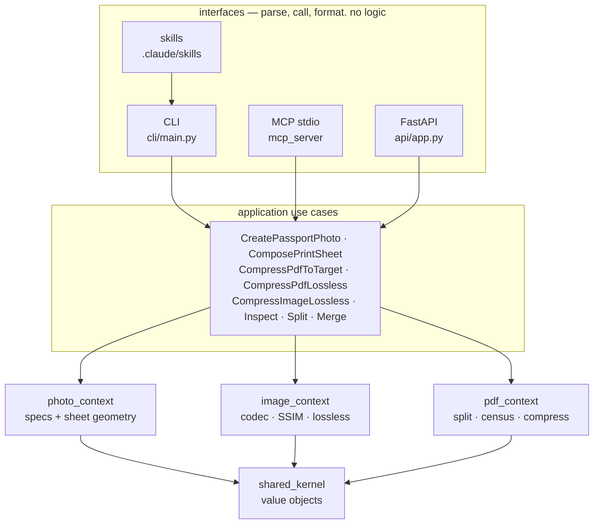
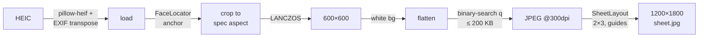

# HLD — Document & Photo Toolkit

> [PRD](PRD.md) → **HLD** → [LLD](LLD.md) → [PLAN](PLAN.md) · v1 · satisfies F1–F7, N1–N5

## System

Four thin interfaces → one application layer → three bounded contexts (DDD, `DOMAIN.md`).

Wife → skills · Prasanth → CLI · Claude/cowork → MCP · hosted UI → API.

## Contexts

| Context | v1 additions | Ports (adapters: current → planned per [RESEARCH](RESEARCH.md)) |
|---|---|---|
| **photo** *(new)* | `PhotoSpec` presets as data (+`min_bytes`, head-rule fields W7) · `SheetLayout` math · use cases | `PhotoRenderer` (Pillow+pillow-heif) · `FaceLocator` (center → **YuNet** landmarks+roll) · `BackgroundMatter` (W7: **MODNet ONNX**) |
| **image** | `CompressImageLossless` | `LosslessOptimizer` (mozjpeg=JPEG, Pillow→**oxipng**=PNG) · `QualityMeter` (numpy SSIM → **SSIMULACRA2**, floor 70/80) · `ImageCodec` (Pillow → +**jpegli `--target_size`** as primary, search demotes to fallback) |
| **pdf** | `CompressPdfLossless` | `StructuralOptimizer` (pikepdf: objstreams, GC, flate, +deflate-JPEGs, +unreferenced-GC) · census: mediabox approx → **CTM-true interpreter** (ocrmypdf port, MPL) + wild-PDF guards + DeviceGray preservation |

## Headline flow

*"Make OCI photos from IMG_1234.heic and a sheet I can print"*

## Decisions

| Decision | Rejected | Why |
|---|---|---|
| new `photo_context` | grow image_context | different invariants (PRD) |
| mozjpeg wheel | Pillow re-save (lossy!), jpegtran binary | pip-installable, MIT, truly lossless |
| MCP via project `.mcp.json` | user-scope | travels with repo; cowork auto-discovers |
| skills shell out to CLI | skills→MCP | stateless, debuggable, same use cases |
| center-crop + `FaceLocator` port | CV now | v1 scope; port keeps door open |
| `tools/venv.sh` wrapped by `//:venv` + hclaude hook | rules_python venv | one script: shell, Bazel, session hook |
| **SSIMULACRA2 floor 70/80** (W6) | keep SSIM 0.90 · LPIPS/DISTS · DSSIM | SSIM 0.90 never binds + luma/pooling blind spots (cited, RESEARCH §3); LPIPS=torch+slow+natural-image-trained; DSSIM=AGPL |
| **jpegli subprocess adapter** (W6) | Pillow-only search · wait for pip package | `--target_size` native, ~35% density, BSD-3; no binding exists → subprocess behind `ImageCodec` |
| **CTM census port from ocrmypdf** (W5) | keep mediabox approx · write interpreter from scratch | fixes hard rule #3; MPL-2.0 matches our posture; battle-tested at 34k★ |
| **MODNet + YuNet** (W7) | RMBG-1.4 · BiRefNet · dlib | Apache-2.0, CPU-fast, small; RMBG non-commercial, BiRefNet wants GPU |
| **limits on by default** (W3) | gotenberg-style ship-disabled | the 87k★/12k★ projects both show defaults-off gets forgotten — we enable |

**Serving language: Python.** Full license-clean engine exists only there; FastAPI ample
for CPU-bound low-QPS. Rust's future = WASM client-side processing (strongest N1);
Go only if single-binary distribution ever matters.

## Licensing (N2) — served path is AGPL-free

pikepdf MPL · Pillow HPND · pypdfium2 BSD · pillow-heif BSD-3 · mozjpeg MIT ·
FastAPI/uvicorn/mcp MIT/BSD. PyMuPDF + Ghostscript = CLI escalation only, quarantined in `agpl/`.

## Runtime

| Thing | How |
|---|---|
| CLI | `tools/cli.sh <cmd>` (venv-backed daily driver, self-bootstraps) · hermetic: `bazel run //:py_cli -- <cmd>` (absolute paths — runs from runfiles) |
| venv | `tools/venv.sh` (idempotent, hash-stamped) — auto at `hclaude`, `bazel run //:venv` |
| MCP | Claude spawns `.venv/bin/python -m pdf_toolkit.mcp_server.server` per `.mcp.json` · W3: `DOC_TOOLKIT_ALLOWED_DIRS` confinement (inputs+outputs), `list_allowed_dirs` tool, no-clobber |
| API | `uvicorn pdf_toolkit.api.app:app` — localhost, tempdir per request, deleted after response · W3: upload cap 413, pixel/page caps 422, 30 s per-op timeout, stderr logging + correlation id |
| gate | `tools/pre-commit.sh` = ruff → format → mypy → pytest (default = fast tier only) → gazelle-diff (`//:pre-commit`) · W4: +coverage; `-m perf`/`-m manual` tiers on demand |
| pre-hosting set | process pool w/ recycling (`max_tasks_per_child` ≈ gotenberg restart-after) · bounded concurrency → 429 · bearer token — required before any non-localhost bind |
