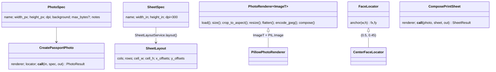

# LLD — Document & Photo Toolkit

> [PRD](PRD.md) → [HLD](HLD.md) → **LLD** → [PLAN](PLAN.md) · names = ubiquitous language (`DOMAIN.md`)

## Layout (new/changed)

```
pdf_toolkit/
├── photo_context/            domain.py services.py ports.py application.py
│   └── infrastructure/       pillow_renderer.py (HEIC via pillow-heif)
├── image_context/            + LosslessOptimizer port · CompressImageLossless
│   └── infrastructure/       + lossless.py (mozjpeg/Pillow)
├── pdf_context/              + StructuralOptimizer protocol · CompressPdfLossless
│   └── infrastructure/       + pikepdf_lossless.py
├── api/app.py                mcp_server/server.py        cli/main.py (+3 cmds)
.claude/skills/{passport-photo,print-sheet,shrink-file}/  CLAUDE.md  .mcp.json
tools/{venv,pre-commit,install-hooks}.sh   pyproject.toml
```

## photo_context types



- All value objects `@dataclass(frozen=True)`, validated in `__post_init__`.
- `PRESETS`: `us_passport` · `india_passport` · `india_oci`(max_bytes=200_000) — all 600×600 @300.
- `SHEETS`: `4x6` (1200×1800) · `6x4`.

## Sheet math (mental model: integer capacity + slack → gutters)

```
cols = ⌊usable_w / cell_w⌋        rows likewise;  0 ⇒ LayoutError
slack distributed as n+1 equal gaps  →  grid centered, gaps = cut lanes
2×2" on 4×6"@300: 600px cells → 2×3, zero gap  (matches commercial strips)
```

## Byte-ceiling encode (shared mental model: binary search a monotone predicate)

```
q=95 fits? done.  else binary-search q∈[60,95] for largest fitting encode
none fits → emit q=60 + warning          (same algorithm as TargetSizeSearch)
```

## Lossless (invariant: decoded pixels bit-identical, never larger)

| Input | Engine | What changes |
|---|---|---|
| JPEG | mozjpeg | Huffman/progressive only — DCT coeffs untouched |
| PNG | Pillow re-save | zlib level 9 |
| PDF | pikepdf save | objstreams · GC · flate recompress · opt-in metadata strip |

## Interfaces

| Surface | Contract |
|---|---|
| CLI | entrypoint `tools/cli.sh` (self-bootstrapping venv; hermetic: `bazel run //:py_cli --`) · `photo IN [--spec S] [--sheet 4x6\|6x4\|none]` · `sheet PHOTO [--size] [--photo-in] [--no-guides]` · `lossless IN [--strip-metadata]` — outputs default next to input |
| MCP `doc-toolkit` | `create_passport_photo` `compose_print_sheet` `compress_pdf` `compress_lossless` `inspect_pdf` `merge_pdfs` `list_photo_specs` — abs paths in, JSON out |
| HTTP | `POST /photo?spec=` `/sheet?size=` `/compress/target?kb=` `/compress/lossless` `/inspect` · `GET /specs /healthz` — multipart in, file out, X-* headers for metrics |
| Skills | infer spec from words ("OCI"→india_oci), zero flags, surface ⚠ warnings |

## Errors

domain `ValueError`/`LayoutError` → CLI exit 2 · API 400/422 · MCP isError.
Unknown preset ⇒ message lists valid options.

## Planned deltas (per [PLAN](PLAN.md) waves — signatures agreed here first)

### Boundary moves (W2)
`shared_kernel` gains: `ImageKind`, `ResampleFilter`, `CompressionTarget`, `TargetSizeSearch`,
`LosslessOutcome`, typed errors (`InvalidInput`, `UnreadableDocument`), constants
(`WHITE`, `GUIDE_COLOR`, `PDF_POINTS_PER_INCH`, `DEFAULT_TARGET_KB`, `bytes_to_kb()`).
`ImageCodec` → `ImageCodec(ABC, Generic[ImageT])`. Dead layer deleted (see REVIEW).

### New ports/adapters (W5–W7)
```python
# image_context — W6
class Ssimulacra2Meter(QualityMeter):        # subprocess ssimulacra2_rs | vendored py
    # score ∈ 0..100; floor 70 portal / 80 archival; compares codec-loss only, native px
class JpegliCodec(ImageCodec):               # subprocess cjpegli
    def encode_to_size(self, img, max_bytes, dpi) -> bytes   # --target_size native

# pdf_context — W5 (ocrmypdf-derived, MPL)
class CtmCensus:                             # content-stream interpreter
    def placements(self, pdf) -> list[ImagePlacement]  # per-Do DPI via hypot(a,b); form-XObj recursion
# census guards: skip SMask'd/JPX/CCITT-G3/Decode-array/<8px; Codec from /Filter; keep DeviceGray

# photo_context — W7
class BackgroundMatter(ABC):                 # MODNet ONNX adapter (Apache-2.0); never RMBG-1.4
    def matte(self, img: ImageT) -> ImageT   # alpha mask; composed via existing flatten()
class YuNetFaceLocator(FaceLocator):         # cv2.FaceDetectorYN, 5 landmarks
    # anchor = face center; roll = atan2(eye_dy, eye_dx); len(faces)!=1 -> warning
```

### PhotoSpec additions (W7) — stays data, not code
`min_bytes: int | None` (pad with trailing NULs after EOI when under — portal minimums) ·
`head_height_frac: tuple[float,float] | None` · `eye_height_frac: tuple[float,float] | None`
(verify-and-warn only; idify-schema shape).

### Config knobs (W3 — enabled by default)
| Env | Default | Effect |
|---|---|---|
| `MAX_UPLOAD_BYTES` | 50 MB | middleware + counted copy → 413 |
| `MAX_IMAGE_PIXELS` | 50 Mpx | `Image.MAX_IMAGE_PIXELS`; bomb → 413 |
| `MAX_PDF_PAGES` | 200 | census reject → 422 |
| `OP_TIMEOUT_S` | 30 | per-op (dict override per endpoint); gs subprocess same |
| `DOC_TOOLKIT_ALLOWED_DIRS` | `~` | MCP `_resolve` + output confinement; `list_allowed_dirs` tool |

## Tests (all green = definition of done)

Tiers: **default** (fast, every run) · `slow` · `perf` (budget asserts) · `manual` (stress) —
markers in pyproject, default `addopts` excludes the last three. Shared fixtures in
`pdf_toolkit/conftest.py` (`portrait`, `jpeg_bytes`, `scan_pdf`, `client`); test bodies =
business assertions only. `pytest-cov` in the gate: ≥80% on domain+application.

| Suite | Proves | Tier |
|---|---|---|
| `photo_context/services_test` | 6-up math, gutters, margins, LayoutError, transpose check | default |
| `photo_context/application_test` | exact px/DPI, OCI ≤200 KB, `min_bytes` pad, HEIC, EXIF, upscale warn | default (+`slow`: 2000² search) |
| `image_context/lossless_test` | pixels `(a==b).all()`, hard rule #1, UnsupportedFormat | default |
| `pdf_context/lossless_test` | page-raster bytes identical pre/post | default |
| `pdf_context/services_test` *(W4)* | TargetSizeSearch floor/convergence, BudgetDecomposition allocation | default |
| `pdf_context/compressor_test` *(W4)* | short-circuit, hard-rule-#1 rollback, escalation (stub engine), **floor binds** (degraded output must fail) | default |
| `pdf_context/census_test` *(W5)* | CTM DPI vs known fixtures, SMask/gray/CMYK/form-XObj not corrupted | default |
| `cli/main_test` · `mcp_server/server_test` *(W4)* | e2e per subcommand; MCP tools + validation + allowlist + no-clobber | default |
| `api/app_test` | round-trips, 422s, 413 oversize, bomb → 413, timeout | default |
| contracts *(W1)* | **N2**: no `fitz`/`agpl` transitively importable from `api`/`mcp_server` | default |
| golden *(W4)* | committed reference outputs ± tolerance (Pillow/mozjpeg drift fence) | default |
| perf *(W4/W6)* | photo <1 s · 16-pg corpus <30 s · encode-count ≥30% down after W6 economies | `perf` |
| stress *(W4)* | 50-pg synthetic scan, near-cap Mpx image, concurrent API | `manual` |
