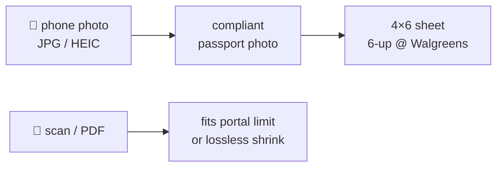

# PRD — Document & Photo Toolkit

> Stack: **PRD** → [HLD](HLD.md) → [LLD](LLD.md) → [PLAN](PLAN.md) → code. Scope changes flow top-down.
> v1 · 2026-07-14 · Owner: Prasanth

## Problem

Immigration paperwork (US/India passport, OCI) = repeated fiddly chores: compliant photos
from phone shots, cheap 4×6 print strips, portal size limits. Online tools leak identity
documents. **Everything must run locally.**

## Users × interfaces

| User | Interface | Bar |
|---|---|---|
| Prasanth | CLI / API / code | expert |
| Wife | Claude in this dir, plain English + file drop | **zero flags, zero paths** |
| Claude / cowork | MCP tools | programmatic |
| Future hosted UI | HTTP API | n/a |

## Requirements

| # | Requirement | Pri |
|---|---|---|
| F1 | US/India passport + OCI photo from JPG/**HEIC** (EXIF-aware, white bg, exact px/DPI, byte **ceiling** e.g. OCI ≤ 200 KB **and floor** — portals also enforce minimum sizes; pad when under) | P0 |
| F2 | **Lossless** compress: JPEG (mozjpeg), PNG (oxipng), PDF (structural + JPEG-deflate) — pixels bit-identical | P0 |
| F3 | 4×6 / 6×4 print sheet, 6-up @ 300 DPI, cut guides, auto-orientation | P0 |
| F4 | Claude Code **skills** (plain English) | P0 |
| F5 | **MCP** server, project-scoped, **path-confined** (allowlist dirs, no silent overwrite) | P0 |
| F6 | **HTTP API** (FastAPI) with **resource limits on by default** (upload cap, pixel/page caps, timeouts) | P1 |
| F7 | Target-size PDF engine: quality floor must **bind** — perceptual metric with human-anchored threshold (SSIMULACRA2 ≥ 70 portal / 80 archival; SSIM 0.90 shown decorative — [RESEARCH §3](RESEARCH.md)) and census DPI from true CTM | P0 |
| F8 *(v2)* | Background → plain white: MODNet ONNX matting (Apache-2.0, CPU <1 s); RMBG-1.4 excluded (non-commercial) | P2 |
| F9 *(v2)* | NL-directed image cleanup ("remove shadow bottom-left") — own mini doc-stack first | P2 |
| F10 *(v2)* | Face-aware crop + compliance verification: YuNet landmarks → anchor/roll/head-height check against spec rules-as-data | P2 |

**Non-functional:** N1 local-only/privacy · N2 no AGPL on any served path — **enforced by an
import-contract test, not convention** (one breach shipped before the test existed) · N3 never
worsen output (no larger files, no silent upscale, no below-floor quality returned as success) ·
N4 one-command venv, auto at `hclaude` start · N5 one ubiquitous language across Py/Go/Rust
(`DOMAIN.md`) · N6 untrusted-input safety: reject-before-decode caps (pixels, pages, bytes),
subprocess timeouts, wild-PDF guards (SMask/JPX/CCITT-G3).

**Out of v1:** F8/F9/F10 (→ [PLAN](PLAN.md) Wave 7), hosted UI itself (pre-hosting hardening set defined in [RESEARCH §4](RESEARCH.md)).

**Prior art (2026-07-15, [RESEARCH](RESEARCH.md)):** no OSS project >5★ combines per-image
byte-budget decomposition + perceptual floor + surgical replacement; OCRmyPDF (34k★) has the
best mechanics to port (MPL-2.0-compatible), HivisionIDPhotos (21k★) validates the photo
feature set but not the algorithms. Our differentiators are the budget solver, floors-as-data,
and the license quarantine.

## Success = 

- Wife: HEIC drag-in → *"make passport photos"* → photo + sheet, < 1 min, no questions.
- OCI portal accepts output (square JPEG ≤ 200 KB). Walgreens 4×6 print cuts into 6 correct 2×2".
- Lossless PDF ≥ 5% smaller, rasters bit-identical. Hard rules = passing tests.
- Quality floor demonstrably binds: a degraded-output test fails the floor (it cannot today).
- A crafted hostile input (bomb/oversize/corrupt) gets a 4xx, not a hung process or a 500.

## Product decisions

| Decision | Why |
|---|---|
| Photo = new bounded context, not image_context feature | print geometry + compliance ≠ byte-budget compression |
| Specs are **data presets** (`us_passport`, …) | new country = new row, not new branch |
| Byte ceilings reuse `TargetSizeSearch` | one algorithm home |
| Skills → CLI; MCP/API → use cases directly | subprocess = stateless; server = warm imports; same use cases |
