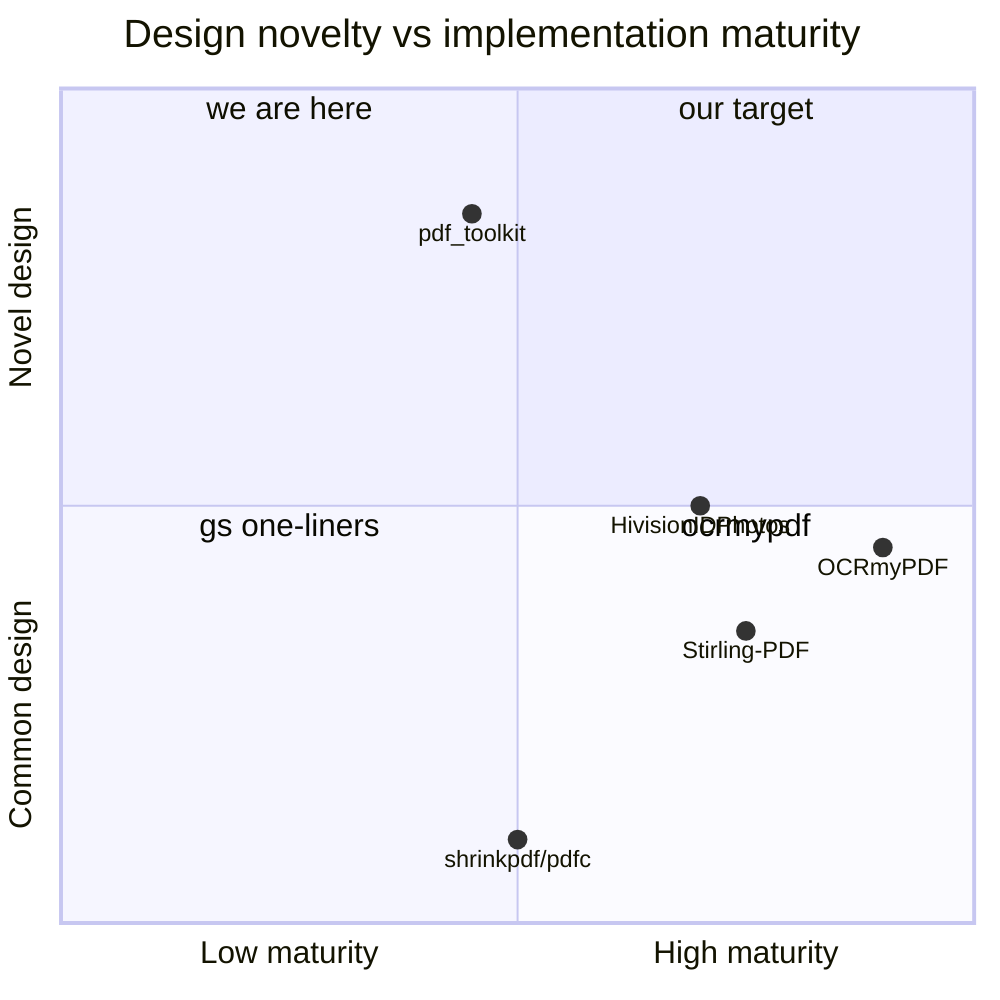

# RESEARCH — OSS landscape & state-of-the-art comparison (2026-07-15)

> 4 parallel deep-research agents; every star count verified via GitHub API on 2026-07-15;
> only projects >5★ considered; sources read from raw code, not READMEs. Full citations at
> the end of each section's agent report (this file keeps the synthesis).

## Headline verdict

**No project >5★ implements our combination** — per-image byte-budget decomposition ∝
rendered area + perceptual quality floor + surgical pikepdf replacement + license-quarantined
escalation. It is genuinely unrepresented in OSS. **But** our *implementation* trails
best-in-class mechanics in three places, and one core assumption (SSIM 0.90) is
invalidated by current research.

## 1. PDF compression (vs pikepdf/Ghostscript ecosystem)

| Project | ★ | Target-size | Perceptual floor | Surgical | Bitonal | License |
|---|--:|---|---|---|---|---|
| **ours** | – | ✅ budget ∝ area | ✅ (see §3 caveat) | ✅ pikepdf | stub | MPL-clean |
| OCRmyPDF `optimize.py` | 34,188 | ❌ fixed presets | ❌ | ✅ | ✅ best (JBIG2) | MPL-2.0 |
| Stirling-PDF | 87,173 | ⚠ 9-level whole-doc ladder | ❌ | ✅ (re-decodes all) | ❌ | custom |
| pdfsizeopt | 896 | ❌ lossless-appearance | – | ✅ | ✅ jbig2 | GPL-2.0 |
| pdfc / shrinkpdf / gsx | 475/238/64 | ❌ one gs pass | ❌ | ❌ re-distill | via gs | MIT/BSD |

- No >5★ project does per-image budget decomposition; none at *any* star count found does an SSIM-style floor.
- **ocrmypdf's CTM machinery** (`pdfinfo/_contentstream.py`): full content-stream interpreter — `q/Q/cm` stack, per-placement DPI `hypot(a,b)`, Form-XObject recursion, harmonic-mean page profile. **Ours assumes every image spans the mediabox** — violates our own hard rule #3, collapses budget weights to uniform on multi-image pages. MPL-2.0 → portable.
- ocrmypdf robustness we lack: skip SMask-bearing images (we'd silently break alpha), CCITT `/K>=0`, JPX, `/Decode` arrays, <100 B streams; **preserve DeviceGray** (we coerce everything to DeviceRGB — ~3× size penalty on gray scans); `keep_fields` whitelist when rewriting XObject dicts; `deflate_jpegs` (free lossless bytes); `remove_unreferenced_resources()`.
- Stirling's image-dedup-by-hash before compression: merged portal uploads often duplicate scans; we'd pay the budget twice.

## 2. Passport/ID photos (vs Pillow/matting ecosystem)

| Project | ★ | Face crop | Matting | Specs-as-data | KB target | Sheet | License |
|---|--:|---|---|---|---|---|---|
| **ours** | – | port (null) | F8 planned | ✅ richest (px+dpi+bytes) | ✅ binary search+floor | ✅ computed gutters | clean |
| HivisionIDPhotos | 21,246 | MTCNN/RetinaFace | MODNet et al. | ⚠ px-only CSV | ⚠ linear walk, **no floor**, NUL-pads | fixed 6-inch | Apache-2.0 |
| rembg | 23,811 | – | u2net/isnet/birefnet | – | – | – | MIT |
| LiYing | 3,239 | YuNet+YOLOv8 | RMBG-1.4 | ✅ incl. FileSizeMin/Max | ✅ range+padding | ✅ | **AGPL** — read-only |
| idify | 1,042 | manual+rules | isnet WASM | ✅ **544 countries** (`rules{minHeadHeight…}`) | ❌ | ❌ | GPL-3.0 |
| dpar39/ppp | 216 | dlib crown-chin (SCFace-trained) | ❌ | ✅ with tolerance bands | ❌ | ✅ | GPL-3.0 |

- **Our KB-targeting beats both big projects** (O(log) encodes + floor + warning vs Hivision's q95→−5 walk to q1).
- F8 answer: **MODNet photographic ONNX — 24.7 MB, Apache-2.0, <1 s CPU** (Hivision's default); integrate via ~80-line onnxruntime adapter, our `flatten()` already does the rest. **Avoid RMBG-1.4 (BRIA non-commercial)**.
- FaceLocator answer: **YuNet** (`cv2.FaceDetectorYN`, 345 KB, Apache-2.0) — box + 5 landmarks → anchor + roll-angle (`atan2(eye_dy,eye_dx)`) correction.
- Compliance math worth porting as *data*: idify `rules{minHeadHeight: 0.729, minHeadOffset}` per spec; Hivision face-center at 0.45 height, head-top clamp measured on the **matting alpha bbox**; ppp's crown-chin tolerance bands.
- Portal reality we missed: **minimum** file sizes exist → `min_bytes` on PhotoSpec + trailing-NUL padding (both Hivision and LiYing do this).

## 3. Quality metrics & encoders (research consensus)

| Metric | SRCC vs MOS (CID22) | CPU | Verdict for inner loop |
|---|--:|---|---|
| global gray SSIM (**ours**) | 0.787 | ms | **effectively no floor** — see below |
| MS-SSIM | 0.804 | low | not worth switching |
| DSSIM (kornelski) | 0.872 | fast | AGPL — no |
| Butteraugli | 0.696 (0.924 near-threshold) | ~1 s/Mpx | get implicitly via jpegli |
| **SSIMULACRA2 v2.1** | **0.890** | ~100 ms/Mpx (C++/Rust) | **the upgrade** — floor 70 (portal) / 80 (archival) |
| LPIPS / DISTS | strong on natural photos | torch, seconds | no — DISTS *forgives* texture change; wrong for text |

Our floor is broken four ways (cited: *Understanding SSIM* arXiv 2006.13846; SSIMULACRA2 CID22):
1. **Calibration off ~10×** — jpeg-recompress's *lowest* preset targets 0.999; our 0.90 passes nearly any q≥30. Decorative.
2. **Luma-only** → blind to stamp-color damage (SSIMULACRA2 uses XYB with a B−Y channel for exactly this).
3. **Global mean pooling** → 95% clean background outvotes a smashed MRZ line (SSIMULACRA2's 4-norm counters this).
4. **1024×768 pre-resize** low-pass-filters away the glyph-edge ringing we need to detect; box windows instead of Gaussian.
Plus a **bug**: floor-violation fallback returns `quality_range[0]` — the *worst* image as punishment for failing quality.

Encoder frontier: **google/jpegli** (BSD-3, active) — `--target_size` is native (internal Butteraugli-distance search); ~35% density gain at same perceptual quality; libjpeg62 ABI. **No pip package exists** → subprocess adapter behind `ImageCodec`. Our binary search survives as the bitonal/fallback path.
Lossless: `pyoxipng` (oxipng ~3k★, MIT) beats Pillow PNG by 10–30%, still bit-exact.

## 4. Serving & MCP patterns

| Project | ★ | Pattern to steal |
|---|--:|---|
| Stirling-PDF | 87,173 | `fileUploadLimit`, per-tool timeouts, async **opt-in** (validates our sync default), temp sweeper `maxAgeHours` |
| gotenberg | 12,639 | 30 s default timeout, process recycling (`restart-after` ≈ `max_tasks_per_child`), body limit (ships **disabled** — the trap we're in) |
| imgproxy | 10,942 | **`MAX_SRC_RESOLUTION` 50 Mpx reject-before-decode**, bounded queue → 429, workers = 2×CPU |
| MCP filesystem (reference) | 88,509 | **allowlist dirs + `list_allowed_directories` tool + MCP Roots** — the norm our `_resolve` should adopt |
| pdf-reader-mcp | 825 | `MCP_PDF_ALLOWED_DIRS` env naming precedent; read-only tool design |
| markitdown-mcp | 166,282 | anti-pattern for us: "no sandbox, just document it" |

Minimal hardening set for local use (all guard-clause-sized): upload cap (middleware + counted copy), explicit `Image.MAX_IMAGE_PIXELS` + page caps, per-op timeout, `DOC_TOOLKIT_ALLOWED_DIRS` confinement (inputs **and** outputs), no-clobber unless `overwrite=True`, stderr logging with correlation ids. Before hosted UI: process pool with recycling + bounded concurrency/429 + bearer token.

## Consolidated adoption backlog (ranked, cross-referenced to REVIEW.md waves)

| # | Adopt | From | Effort | Feeds |
|---|---|---|---|---|
| 1 | CTM-true per-placement DPI census (+Form XObjects) | ocrmypdf `_contentstream.py` (MPL) | ~1 day | REVIEW wave 5 (hard rule #3) |
| 2 | Census safety rails (SMask/CCITT-G3/JPX/Decode guards) + keep DeviceGray | ocrmypdf `optimize.py` | small | wave 5 |
| 3 | SSIMULACRA2 floor 70/80 + fix worst-quality fallback bug + drop pre-resize | cloudinary/ssimulacra2, rust-av CLI | medium | wave 5/6 |
| 4 | jpegli `--target_size` subprocess adapter behind `ImageCodec` | google/jpegli (BSD-3) | medium | wave 6 |
| 5 | Serving minimal-hardening set (6 items above) | Stirling/gotenberg/imgproxy/MCP-fs | ~1 day | wave 3 (already P1s) |
| 6 | F8 = MODNet ONNX adapter; FaceLocator = YuNet + roll correction | Hivision (Apache-2.0), opencv_zoo | medium | Phase 8 |
| 7 | `min_bytes`+padding, head-rule fields on PhotoSpec, sheet transpose check, one-face validation | Hivision/idify/ppp (patterns, not GPL code) | small | Phase 8 |
| 8 | `pyoxipng` PNG lossless; `deflate_jpegs` + `remove_unreferenced_resources` in lossless PDF pass | oxipng, ocrmypdf | trivial | wave 6 |
| 9 | Image dedup-by-hash before budget allocation | Stirling `ImageReference` | small | wave 6 |
| 10 | JBIG2 bitonal branch (optional jbig2enc behind port) | ocrmypdf `convert_to_jbig2` | medium | completes hard rule #2 fix |

## What we do that nobody else does (keep)

Budget decomposition ∝ rendered area · perceptual floor concept (once fixed) · binary-search
byte ceilings with floors and warnings · specs-as-data richer than 21k★ Hivision ·
computed-gutter sheets · AGPL quarantine as an architecture · the doc stack itself.
